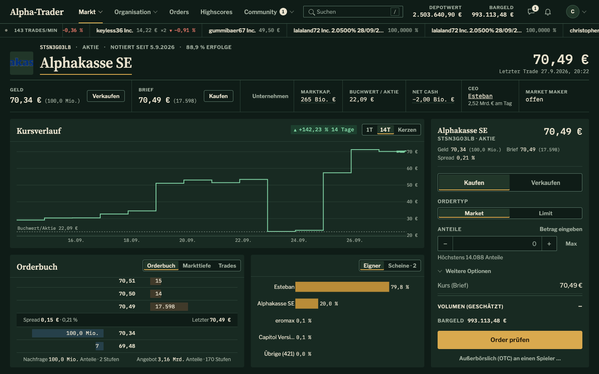
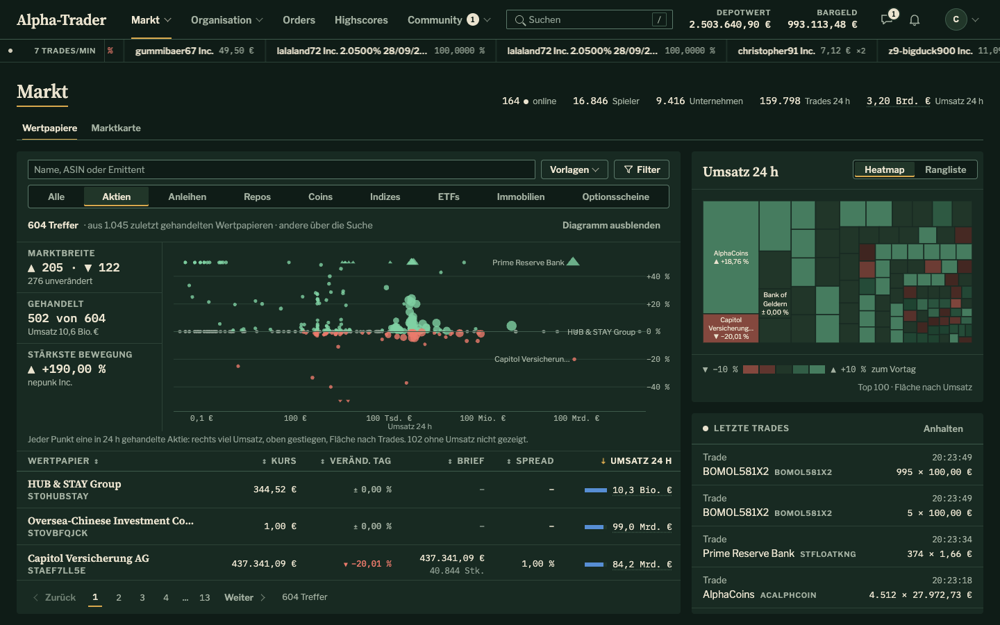
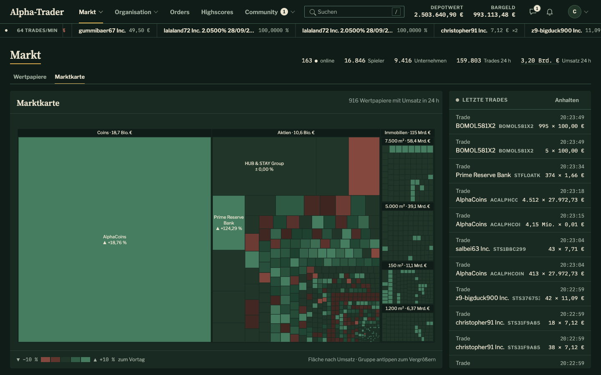
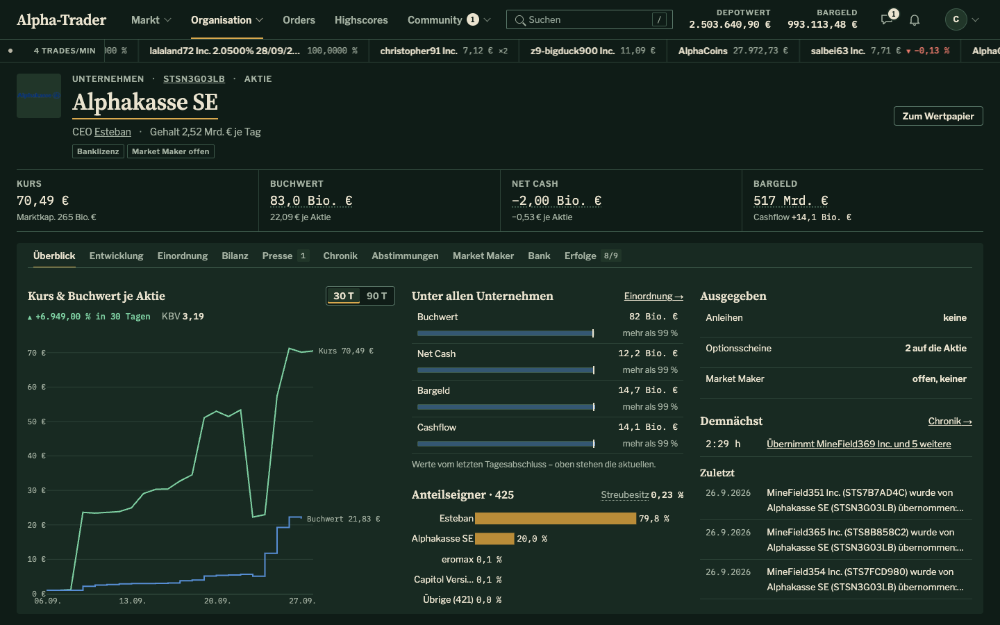
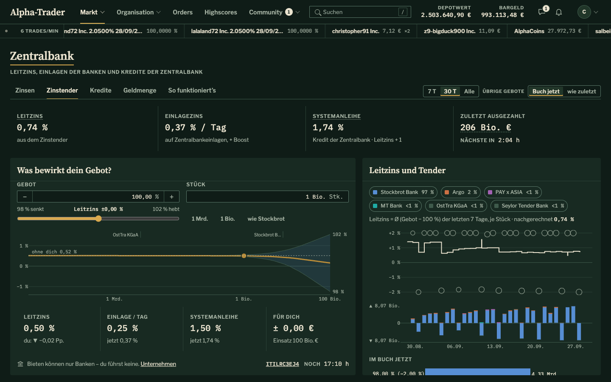
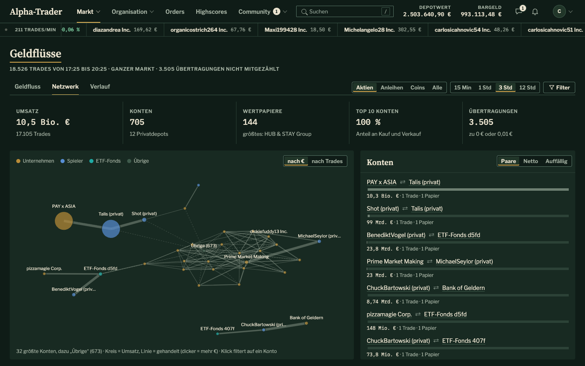
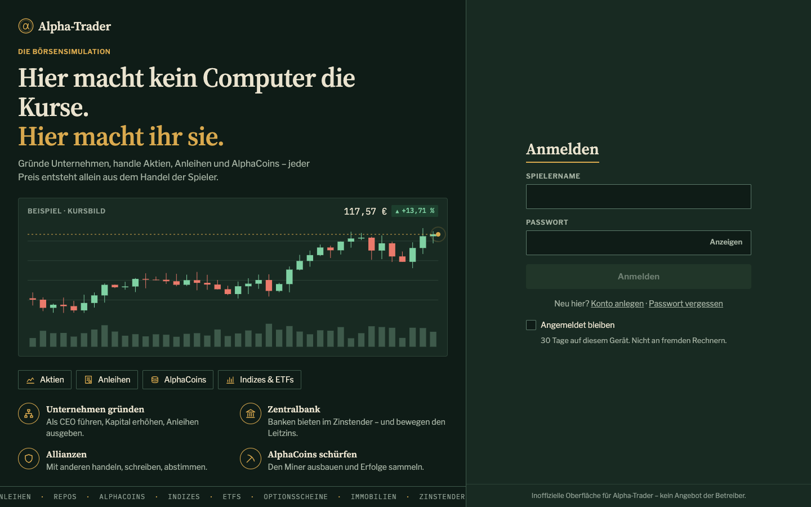
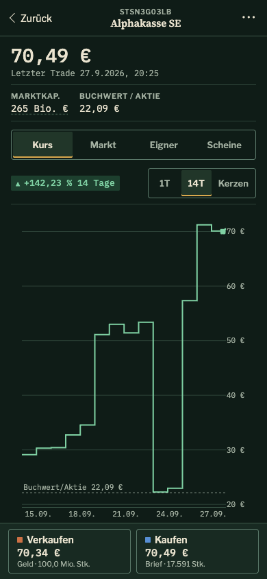
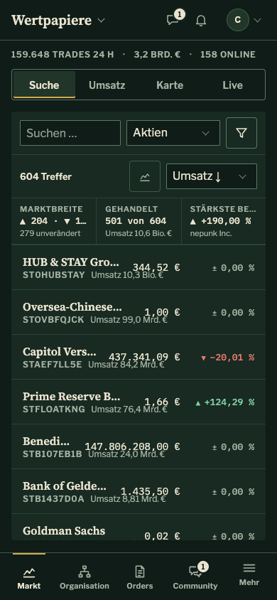
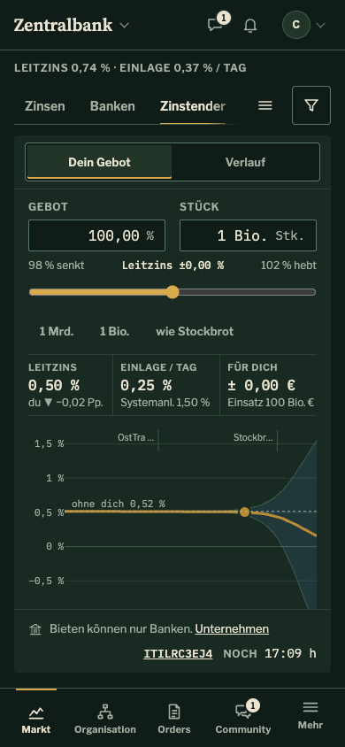

# Alpha-Trader – alternatives Frontend „Bankiersgrün“

Ein inoffizielles Web-Frontend für die Börsensimulation [Alpha-Trader](https://alpha-trader.com).
In Alpha-Trader gründen Spieler Unternehmen und handeln Aktien, Anleihen, AlphaCoins, Indizes, ETFs,
Optionsscheine und Immobilien – jeder Kurs entsteht allein aus dem Handel der Spieler.

Dieses Frontend spricht direkt mit der öffentlichen API des Spiels und setzt auf drei Ideen:

- **Visualisieren statt beschreiben** – Kursverläufe, Orderbuch-Tiefe, Anteilseigner, Geldflüsse,
  Zinstender: alles, was eine Entwicklung oder Verteilung hat, ist ein Diagramm.
- **Eine Seite = ein Bildschirm** – Hauptseiten passen ohne Scrollen auf 1440×900, 1280×720 und aufs Handy.
- **Mobil gleichwertig** – eigene Handy-Layouts mit Bottom-Navigation, Sheets und Handelsleiste in der Daumenzone.

> Inoffizielles Community-Projekt, kein Angebot der Betreiber von Alpha-Trader.
> Du brauchst ein eigenes Alpha-Trader-Konto, um dich anzumelden.

*English summary: an unofficial, visualization-first web client for the German stock market game
Alpha-Trader. React 18 + TypeScript + Vite, talks directly to the public game API. The UI is German.*



## Screenshots

| | |
| --- | --- |
|  |  |
| **Markt** – Screener mit Klassenübersicht, Umsatz-Heatmap, Live-Trades | **Marktkarte** – alles mit Umsatz in 24 h, gruppiert nach Art |
|  |  |
| **Unternehmen** – Kurs vs. Buchwert, Einordnung unter allen Firmen, Anteilseigner, Termine | **Zentralbank** – „Was bewirkt dein Gebot?“: Leitzins live nachgerechnet |
|  |  |
| **Geldflüsse** – wer mit wem handelt, als Sankey, Netzwerk oder Verlauf | **Anmeldung** |

Am Handy:

<p>
  
  
  
</p>

## Was es kann

| Bereich | Seiten |
| --- | --- |
| **Markt** | Screener über alle Anlageklassen mit Filtern, Vorlagen und Histogrammen · Marktkarte · Wertpapierseite je Klasse (Aktie, Anleihe/Repo mit Rendite pro Tag, Index, ETF, Optionsschein mit Auszahlungsdiagramm, Immobilie) · Geldflüsse (Sankey, Netzwerk, Drilldown auf einzelne Konten) · Kapitalmaßnahmen · Zentralbank (Leitzins, Tender, Kredite, Geldmenge) |
| **Organisation** | Portfolio & Performance · eigene Unternehmen mit CEO-Werkzeugen (Kapital, Anleihen, Indizes, ETFs, Optionsscheine, Market Maker) · Bank mit Kontoauszug und Überweisung · Miner-Planer · Erfolge · Abstimmungen |
| **Handel** | Order-Maske mit Vorbelegung aus dem Orderbuch · offene Orders · OTC-Angebote · Market-Maker-Quotes |
| **Community** | Chat (live per WebSocket, angedockte Chat-Leiste) · Zeitung · Forum mit Volltextsuche · Allianzen · Sponsoring · Highscores · Spielerprofile |
| **Überall** | Börsenband mit Live-Trades · globale Suche (`/`) · Farbenblind-Modus · Spielbegriffe mit Hilfetexten des Servers |

## Schnellstart

Voraussetzungen: **Node.js 22** (siehe `.nvmrc`) und npm.

```sh
git clone https://github.com/maltemelzer/alpha-trader-frontend.git
cd alpha-trader-frontend
npm ci
cp .env.example .env      # PARTNER_ID bzw. VITE_PARTNER_ID eintragen (siehe unten)
npm run dev               # http://localhost:5173
```

Angemeldet wird im Browser mit dem eigenen Alpha-Trader-Konto. Der Token liegt nur im `sessionStorage`
des Tabs (bzw. mit „Angemeldet bleiben“ 30 Tage im `localStorage`), es gibt keinen eigenen Server.

### Konfiguration (`.env`)

| Variable | Wofür |
| --- | --- |
| `VITE_PARTNER_ID` / `PARTNER_ID` | Partner-ID, mit der sich das Frontend bei der API anmeldet. Öffentlich, landet im Bundle. |
| `VITE_API_BASE` | API-Server, Standard `https://stable.alpha-trader.com` (außerdem `nightly`, `dev`). |
| `AT_USERNAME`, `AT_PASSWORD` | **Nur für die Entwickler-Skripte** (`api:get`, `shot`, `audit`). Nie committen – `.env` ist ignoriert. |

> **Achtung:** `stable` ist das echte Spiel. Orders, Überweisungen, Abstimmungen usw. aus dem Frontend
> sind echte Spielaktionen. Die Skripte in `scripts/` lesen nur.

## Befehle

| Befehl | Zweck |
| --- | --- |
| `npm run dev` · `build` · `preview` | Vite-Entwicklungsserver, Produktions-Build nach `dist/`, Vorschau |
| `npm test` | Vitest (`src/**/*.test.ts(x)`, `scripts/**/*.test.mjs`) |
| `npm run lint` | ESLint |
| `npm run api:generate` | API-Typen `src/api/schema.d.ts` aus der Live-OpenAPI-Spec neu erzeugen |
| `npm run api:get -- /api/…` | Lesender API-Aufruf mit dem Konto aus `.env`, gibt JSON aus (Tokens geschwärzt) |
| `npm run shot -- /pfad [--size 390x844]` | Screenshot per headless Chrome (Dev-Server muss laufen), meldet Seiten-Scroll und Konsolenfehler; Bilder in `shots/` |
| `npm run audit` | Qualitätsprüfung aller Hauptseiten: Layout-Sprünge, Kontrast, Überläufe, Tippflächen, Navigationsregeln |
| `npm run ds:sync -- <ordner>` | Design-System nach `vendor/bankiersgruen/` übernehmen (nur Maintainer, siehe unten) |

`shot` und `audit` nutzen `puppeteer-core` mit einem installierten Chrome. Liegt Chrome nicht unter
`/Applications/Google Chrome.app`, den Pfad per `CHROME_PATH` setzen.

## Stack

- **Vite + React 18 + TypeScript 5** (strict), reine SPA ohne eigenes Backend.
  React bleibt auf 18, weil das Design-System-Bundle dafür gebaut ist (deshalb auch React Router 7).
- **TanStack Query** für alle API-Daten (Caching, Polling: Kurse/Orderbuch 15 s, sonst 60 s).
- **openapi-fetch** mit Typen, die aus der [OpenAPI-Spec](https://stable.alpha-trader.com/v3/api-docs) generiert werden.
- **Plotly 3** für alle Diagramme, lazy geladen über `<Plot figure={(theme, width) => …} />`.
- **STOMP über WebSocket** (`@stomp/stompjs`) für Live-Chat.
- **Vitest + Testing Library** – über 500 Tests, vor allem für die reinen Rechenfunktionen.

## Projektaufbau

```
src/
  api/          client.ts (openapi-fetch + Auth), queries.ts (ein Hook je Endpunkt),
                schema.d.ts (generiert), types.ts, live.ts (WebSocket)
  app/          AppShell, Navigation, Börsenband, Handy-Bausteine (phone.tsx), gemeinsames Layout
  auth/         Login-Zustand, Token-Weitergabe zwischen Tabs
  charts/       Plot.tsx (Plotly-Hülle), Achsen-Helfer
  lib/          Formatierung, Übersetzung der Server-Texte, URL-Zustand, Hooks
  security/     Wertpapierseite – das Muster für alle anderen Seiten
  market/ flows/ centralbank/ companies/ organisation/ me/ orders/ chat/ forum/ news/ …
                je Spielbereich ein Ordner
vendor/bankiersgruen/   Design-System (Kopie, nicht von Hand ändern)
scripts/        api-get, shot, audit, sync-design-system
docker/         nginx-Konfiguration und Deploy-Anleitung
```

Jede Seite folgt demselben Muster (Vorbild `src/security/`):

- `XyzPage.tsx` – Layout und Zustand; Ansichten und Filter stehen in der URL (`?ansicht=…&zeitraum=…`),
  damit jede Ansicht verlinkbar und fotografierbar ist.
- `derive.ts` (+ `derive.test.ts`) – **reine** Rechenfunktionen, getestet.
- `charts.ts` – Plotly-Figuren als reine Funktionen von Daten, Theme und Breite.

## Design-System „Bankiersgrün“

Die Oberfläche baut auf einem eigenen Design-System auf: dunkles Flaschengrün mit Messing,
Source Serif 4 / Libre Franklin / IBM Plex Mono, deutsche Zahlenformate (`1,5 Mio. €`, echtes `−`),
Kursrichtung immer mit ▲/▼. Komponenten, Tokens und Plotly-Templates liegen als Kopie in
`vendor/bankiersgruen/` (Markenbuch: [`vendor/bankiersgruen/README.md`](vendor/bankiersgruen/README.md),
Diagrammregeln: [`diagramme.md`](vendor/bankiersgruen/diagramme.md), Typen: `index.d.ts`).

Eingebunden wird es über `import { DS } from './ds'`. Farben kommen ausschließlich aus Tokens
(`var(--bg-card)` …), nie als Hex im Code – so funktioniert auch der Farbenblind-Modus (`data-theme="cb"`).

Die Quelle des Design-Systems wird außerhalb dieses Repos gepflegt; `npm run ds:sync` übernimmt neue
Versionen. Braucht eine Änderung eine neue oder erweiterte Komponente, bau sie zunächst in der App
und beschreib sie im Pull Request – sie kann dann ins Design-System wandern.

## Mitmachen

Beiträge sind willkommen – Details in [CONTRIBUTING.md](CONTRIBUTING.md). Kurz:

1. `npm test`, `npm run lint` und `npm run build` müssen grün sein (CI prüft das bei jedem Pull Request).
2. Bei UI-Änderungen Screenshots in 1440×900, 1280×720 und 390×844 (`npm run shot`) und `npm run audit`.
3. Code und Commits auf Englisch, Oberflächentexte auf Deutsch, Anrede „du“.

**Wissensspeicher:** [`CLAUDE.md`](CLAUDE.md) ist die ausführliche Projektdokumentation – Gestaltungsregeln,
Aufbau jeder Seite und vor allem die **Stolperfallen der API** (welcher Endpunkt was wirklich liefert,
wie Leitzins, Optionsscheine oder Anleihen rechnen). Der Name kommt daher, dass die Datei auch als
Kontext für [Claude Code](https://claude.com/claude-code) dient, mit dem ein großer Teil dieses Projekts
entstanden ist. Vor größeren Änderungen lohnt sich ein Blick hinein.

## Betrieb

Der Produktions-Build ist statisches HTML/JS. Mit Docker (nginx, Port `PORT` bzw. 9010):

```sh
docker compose up -d --build
```

Die Partner-ID kommt als Build-Argument aus `.env`; die `.env` selbst landet nicht im Image.
Für andere Plattformen (z. B. Raspberry Pi): `docker buildx build --platform linux/arm64 --build-arg VITE_PARTNER_ID=… .`
Die automatische Auslieferung des Maintainers ist in [`docker/README.md`](docker/README.md) beschrieben.

## Lizenz

[MIT](LICENSE). „Alpha-Trader“ ist ein Name der Betreiber des Spiels; dieses Projekt steht in keiner
Verbindung zu ihnen. Spieldaten in den Screenshots stammen aus dem öffentlichen Spiel.
